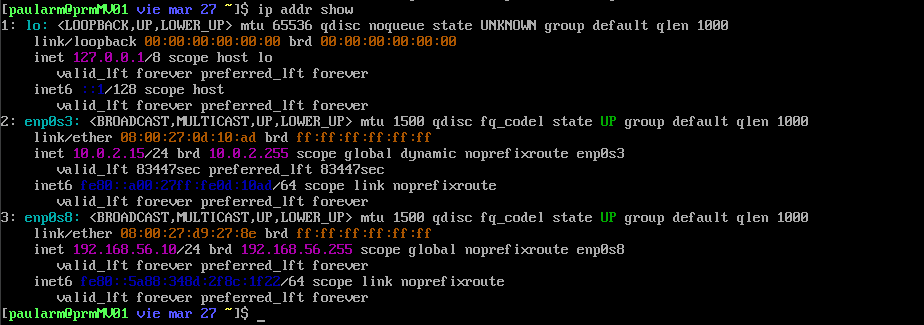
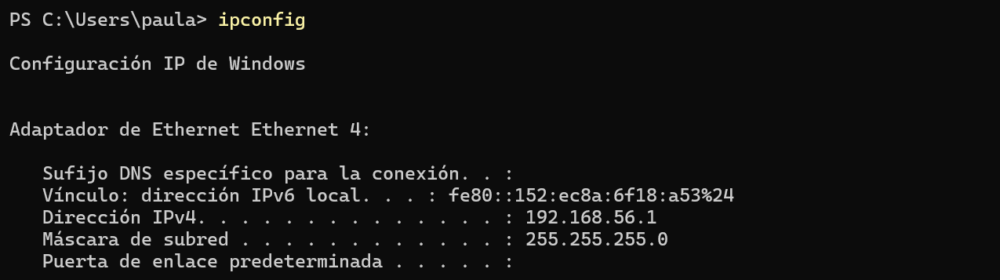
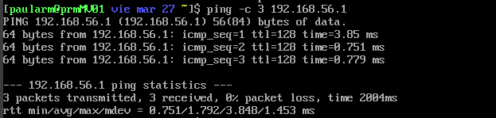
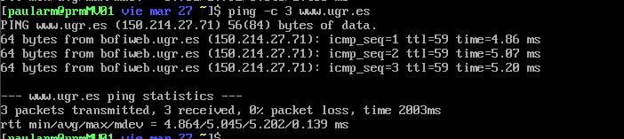
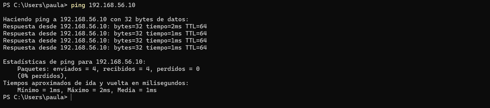
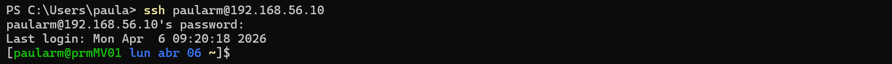

# Memoria de Prácticas: Ingeniería de Servidores
**Autor:** Paula Rodriguez Montoro
**Curso:** 2025/2026
**Repositorio:** [Enlace a mi GitHub](https://github.com/Paularodm/Ingenieria-Servidores-Practicas)

---

## BLOQUE 1: Configuración del Entorno y Administración

### Práctica 1: Instalación y configuración de un servidor básico Rocky Linux
El objetivo de esta primera prática es la instalación y configuración inicial de un servidor sobre un entorno de virtualización. He llevado acabo la gestión de red dual, configurando un adaptador NAT para salida a Internet y un adaptador Host-Only con IP estática para la gestión desde el equipo anfitrión. A continuación, realicé la personalización del prompt de la shell y del hostname. Finalmente, llevé a cabo la configuración del servicio SSHD para el acceso remoto y gestión de usuarios con privilegios de superusuario. 

#### Pasos realizados:
1. Descarga de la ISO.
2. Configuración de red en modo Puente/NAT.
3. Creación del usuario administrador.
4. Configuración de Red en el Servidor (IPs).
5. Personalización del prompt.
6. Validación de la conectividad.

#### Capturas de pantalla:

> *MV: IPs configurada en la tarjeta NAT y Host-Only.*

> *Host: IP configurada en la tarjeta Host-Only.*

> *MV: Ping efectivo al Host.*

> *MV: Ping efectivo a www.ugr.es.*

> *Host: Ping efectivo a la MV.*

> *Host: Conexión por ssh a la MV.*
---

