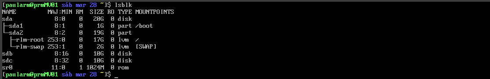
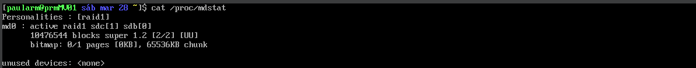
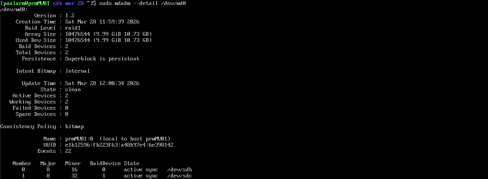
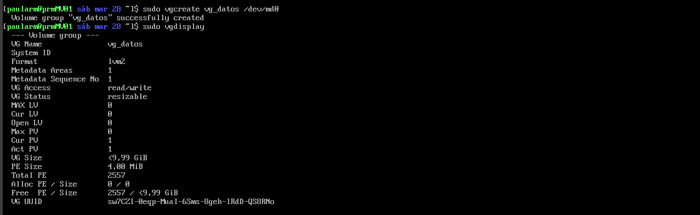
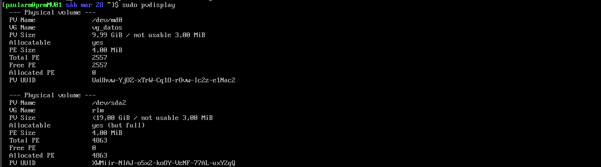
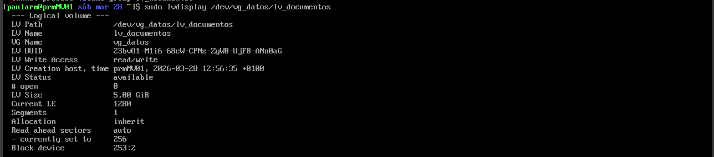
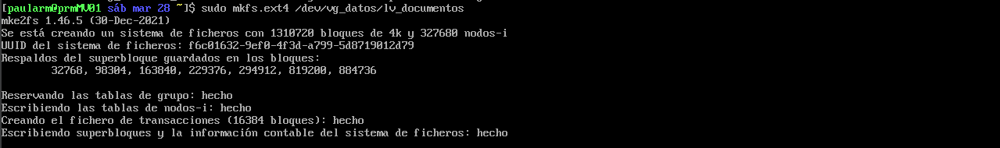
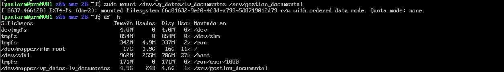
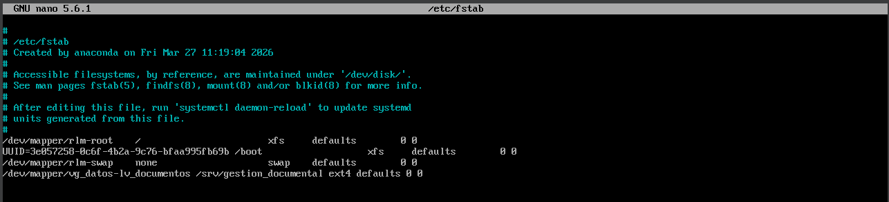

# Memoria de Prácticas: Ingeniería de Servidores
**Autor:** Paula Rodriguez Montoro
**Curso:** 2025/2026
**Repositorio:** [Enlace a mi GitHub](https://github.com/tu-usuario/tu-repo)

---

## BLOQUE 1: Configuración del Entorno y Administración

### Práctica 2: Configuración de LVM y RAID
Se desea instalar un servicio de gestión documental en el servidor. Se espera que este servicio
precise de una cantidad espacio de almacenamiento creciente con el tiempo, pudiendo llegar a
ser considerable. Por otro lado, el contenido será crítico, por lo que se desea proporcionar
algún mecanismo de respaldo ante fallos en el dispositivo de almacenamiento.

Para ello utilizaremos las herramientas de RAID y LVM. En particular, raid 1, para agrupar dos discos físicos en un único dispositivo virtual, de manera que si uno de ellos se avería o falla el sistema continue operando sin pérdida de información gracias a la replica exacta en el segundo disco. Y sobre esta base segura del RAID, implementaremos LVM para gestionae el espacio de forma flexible, mediante physical volumes, volume groups y logical volumes. Además podremos expadir la capacidad de almacenamiento "en caliente" sin interrumpir el servicio. 

#### Pasos realizados y Capturas de pantalla:

#### RAID: 

1. Añadir los discos en Virtual Box.
2. Comprobar que se encuentran disponibles con lsblk.
   

3. Crear el raid utilizando el comando mdadm.

* `--create /dev/md0` : Define el nombre del nuevo dispositivo RAID en el sistema.
* `--level=1` : Selecciona el nivel RAID 1, esencial para datos críticos ya que si un disco falla, la información permanece intacta en el otro.
* `--raid-devices=2` : Indica el número de discos físicos que componen el array.
* `/dev/sdb /dev/sdc` : Son los "ingredientes" o dispositivos de bloque que hemos añadido previamente.
  
4. Comprobar el raid se ha creado correctamente.

Podemos observar que el raid se ha creado correctamemte pues:
* `md0 : active raid1 sdc[1] sdb[0]` : Confirma que estan activos y participando en "espejo".
* `[UU]` :  Ambos discos estan operativos: U (Up)

Tras la ejecución de `mdadm`, se ha verificado mediante `mdadm --detail` que el estado del array es active y que cuenta con dos unidades sincronizadas (`active sync`). Esto cumple con el requisito de proporcionar un mecanismo de respaldo ante fallos físicos en el almacenamiento.

5. Persistencia en la configuración. 

Para realizar la configuración del RAID y la persistencia en `/etc/mdadm.conf`, se han empleado privilegios de superusuario mediante el comando `sudo`, garantizando así el acceso a los archivos de configuración del sistema y a los dispositivos de bloque.

#### LVM:

6. Crear el physical volume (pv).

Este paso prepara el dispositivo RAID para ser integrado en LVM.

Para ver si se ha creado correctamente: `sudo pvdisplay`

Podemos ver que se ha creado el pv, pero que no tiene asociado ningún vg: `Allocatable=NO`

7. Crear el volume group (vg).

Usaremos este componente para agrupar el espacio de almacenamiento del RAID, para gestionar de forma centralizada los logical volumes (lv) que se dispongan sobre él. No mezclaremos la información almacenada en los RAID con la que no lo esta.

Si volvemos a ejecutar de nuevo `pvdisplay` vemos como ahora si nos aparece como `VG Name` `vg_datos` y `Allocatable=yes`

8. Crear el logical volume (lv).

Ahora que tenemos el vg que solo contiene espacio seguro del RAID, asignamos el espacio que usaremos realmente (lv): 
   

   
* `-L 5G` : indica el tamaño del lv
* `-n lv_documentos` : nombre del lv
* `vg_datos` : situado en el vg vg_datos
  
Veamos que esta creado con las propiedades indicadas:

9. Proporcionar sistema de archivos.

Hasta ahora, tenemos el "contenedor" de almacenamiento, pero el sistema operativo necesita una estructura organizada para poder leer y escribir los archivos de tu servicio de gestión documental.

10. Crear un Punto de Montaje. 

Necesitamos una ubicación en la estructura estándar de directorios de Linux para acceder a los datos.

    
11. Montaje Manual del lv y Verificación.

Vinculamos el dispositivo lógico a la carpeta creada. Y ejecutaremos `df -h` para verificar que el nuevo disco de 5GB aparece montado en la ruta correcta.

12.  Persistencia en la configuración.

Editamos el archivo `/etc/fstab` para que el servicio no falle tras reiniciar el sistema, es decir, se mantega el montaje.

