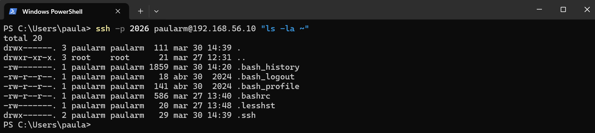
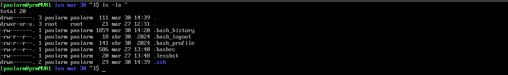

# Memoria de Prácticas: Ingeniería de Servidores
**Autor:** Paula Rodriguez Montoro
**Curso:** 2025/2026
**Repositorio:** [Enlace a mi GitHub](https://github.com/Paularodm/Ingenieria-Servidores-Practicas)

---

## BLOQUE 1: Configuración del Entorno y Administración

### Práctica 3: Acceso seguro al servidor: Firewall + SSHD

Esta practica se divide en dos partes. El objetivo de la primera parte es saber gestionar el Firewall. Para ello hemos de instalar un servidor de HTTP, modificar su home page para mostrar un mensaje y conseguir que el servicio web este accesible desde la MV (en el puerto por defecto 80) y desde el Host (usando un navegador web).

#### 4.1.1.- Ejercicio. Instalación y configuración de un servidor de HTTP: 
#### Pasos realizados:
1. Instalación del servidor HTTP.

* `sudo dnf install httpd` : Instalar Apache (http)
* `sudo systemctl start httpd` : Iniciar el servicio 
* `sudo systemctl enable httpd` : Asegurar el inicio automatico 
* `sudo systemctl status httpd` : Comprobar el estado
  
2. Personalización de la Home Page.

El servidor Apache busca por defecto el archivo `index.html` en la ruta `/var/www/html/`. Este es el archivo en el que incluimos la linea: "Bienvenidos a la web de Paula Rodriguez Montoro en Prácticas ISE". 

3. Configuración del Firewall.

Abrimos el firewall del servicio http: `sudo firewall-cmd --permanent --add-service=http`. 
Aplicamos los cambios: `sudo firewall-cmd --reload`.

4. Verificación Final:
   
* Acceso desde el ordenador anfitrión, empleando un navegador web, al servidor HTTP
configurado en la MV. Debe apreciarse claramente la IP de la MV en la dirección del
navegador.

* Resultado del escaneo de puertos con nmap desde el ordenador anfitrión a la MV

#### 4.2.1.- Ejercicio. Configuración de SSHD: 
#### Pasos realizados:

1. Modificación del puerto en el que se ejecuta SSHD:
   
   1.1. Elegimos un puerto que no se este usando, por ejemplo yo he cogido el 2026. 
   1.2. Actualizamos el firewall para que permita el acceso a dicho puerto: `firewall-cmd --permanent --add-port=<puerto>/tcp`.  
   1.3. Cambiamos el puerto de acceso sshd en el archivo `/etc/ssh/sshd_config` . Inidcamos que tiene acceso seguro con `semanage` y actualizamos con `sudo systemctl restart`.  

2. Conceder acceso remoto por llave pública al usuario paula.
   
   1.1. Generación del par de llaves en el Host (Ordenador Anfitrión). 
   El primer paso es crear nuestra identidad digital basada en criptografía asimétrica.
   Ejecutamos en la terminal del anfitrión el comando `ssh-keygen -t rsa -b 4096`. 
   1.2. Transferencia de la llave pública al servidor. 
   1.3. Validación mediante ejecución remota.  
   
    Capturas:

> *Host: Ssh efectivo y resultado de ejecucion ls -la ~.*

> *MV: Resultado de ejecucion ls -la ~.*
---

