# Memoria de Prácticas: Ingeniería de Servidores
**Autor:** Paula Rodriguez Montoro
**Curso:** 2025/2026
**Repositorio:** [Enlace a mi GitHub](https://github.com/Paularodm/Ingenieria-Servidores-Practicas)

---

## BLOQUE 1: Configuración del Entorno y Administración

### Práctica 2: Automatización de la configuración con Ansible.
El objetivo de esta práctica es el despliegue automatizado de una infraestructura web y de gestión de usuarios sobre dos nodos (Apache y Nginx). Se ha utilizado Ansible para garantizar la idempotencia y la escalabilidad del sistema mediante el uso de variables y llaves públicas.

Partiendo de dos servidores, configurados de acuerdo a los requerimientos del apartado 2.

1. Añadimos un usuario (admin) con acceso por SSH con llave pública y con privilegios para ejecutar
comandos de root sin contraseña.

> *S1Apache: Creación del nuevo usuario.*
> 

> *S2Nginx: Creación del nuevo usuario.*

> *S1Apache: Permisos de superusuario añadiendo al nuevo usuario al grupo wheel, con permisos sin contraseña.*

> *Permisos de superusuario añadiendo al nuevo usuario al grupo wheel, con permisos sin contraseña.*

> *NodoControl: Generación llave pública.*

> *S1Apache: Copiar la clave pública al servidor y añadirla al archivo ~/.ssh/authorized_keys d.*

> *S2Nginx: Copiar la clave pública al servidor y añadirla al archivo ~/.ssh/authorized_keys d.*

2. Instalación de Ansible y creación del Playbook.
   
1.1. Instalamos Ansible en el Nodo de Control. 

1.2. Creamos el Inventario: `hosts.yaml`.

El inventario de la infraestructura es el conjunto de servidores sobre el cual Ansible orquestará todas las tareas. En nuestro caso, uno como servidor web Apache y otro como servidor web Nginx.
Los usuarios "admin" de estos dos servidores son `angel` y `cristina`. 

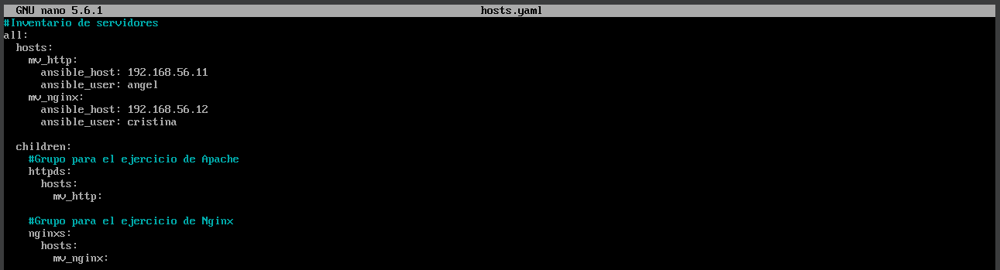

1.3. Creamos el archivo de variables: `vars.yaml`.

El archivo `vars.yaml` lo creamos con el objetivo de conseguir escalabilidad, reutilización y mantenibilidad.

El uso de una lista variable llamada `usuarios_sistema` permite que el Playbook sea escalable. Si en el futuro fuera necesario dar de alta a diez usuarios en lugar de dos, solo habría que modificar este archivo de variables, manteniendo el Playbook intacto. Esto reduce el riesgo de errores al editar el código principal.

Dicha lista funciona como un diccionario, donde cada elemento contiene pares clave-valor (`nombre` y `key`). Este diseño permite que Ansible recorra los datos mediante un bucle (`loop`), procesando cada usuario de forma atómica y consistente.

Además la gestión de las llaves públicas se hace mediante el uso de la función `lookup('file', ...)`. Esta permite que Ansible lea el contenido de un archivo físico en el Nodo de Control en tiempo de ejecución. De esta forma, no pegamos la clave pública entera en el código. Esto mantiene el archivo de variables limpio y permite gestionar las llaves como archivos independientes en la carpeta `files/`.

La variable `nombre_completo` se utiliza como un parámetro de entrada para el módulo de plantillas (template o copy). Esto demuestra la capacidad de Ansible para personalizar servicios en este caso, la página index.html de Apache y Nginx.

Al definir el `nombre_grupo_gestion: "rueda"` en un solo lugar, nos aseguramos de que tanto la creación del grupo, como la configuración de sudoers y la asignación de usuarios apunten siempre al mismo valor. Si el nombre del grupo de gestión cambiar solo se actualizaría una línea en este archivo.

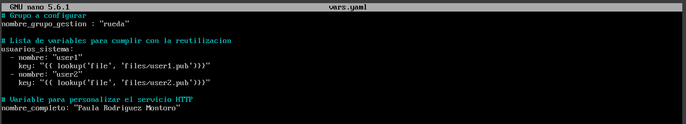

1.4. Creamos el Playbook

El Playbook se ha diseñado como el encargado de transformar dos nodos recién instalados en servidores funcionales y seguros. El archivo se divide en tres bloques lógicos:

* Configuración Global y Seguridad
  
  En la cabecera del Playbook, se define el alcance mediante `hosts: all` y se asegura la escalada de privilegios con `become: yes`. La directiva `vars_files` permite la carga del artefacto de variables ya comentado.

  Se automatiza la creación del grupo `"rueda"`. Mediante el módulo `lineinfile`, se modifica el archivo `/etc/sudoers` para otorgar permisos de superusuario a los miembros de dicho grupo. El parámetro `validate` invoca a visudo -cf antes de guardar los cambios evitando así posibles corrupciones en el sistema de permisos.

  Se utiliza un bucle sobre la lista de usuarios. El módulo `user` garantiza la creación del entorno de trabajo, mientras que el módulo `authorized_key` inyecta las llaves públicas definidas en el archivo de variable, necesario para cumplir con el requisito de acceso seguro mediante autenticación asimétrica SSH.

* Despliegue de Servicios Web
  
  El bloque de Apache solo se ejecuta si el nodo pertenece al grupo `httpds`, y el de Nginx si pertenece a `nginxs`.
 
  Para poder utilizar la variable `{{ nombre_completo }}` personalizando la página web de cada servidor con los datos del administrador en tiempo real, empleamos el parámetro `content` en el módulo de copia para generar un index.html en tiempo real. 

  Por ultimos nos aseguramos de que los demonios httpd y nginx estén activos `stated` y configurados para iniciarse automáticamente tras un reinicio del sistema `enabled: yes`.

* Configuración del Perímetro de Seguridad
  
  El último bloque se encarga de la persistencia de las reglas de red mediante el módulo `ansible.builtin.firewalld`.
  Se realiza un bucle para habilitar los servicios http (puerto 80) y ssh (puerto 22). El uso de `permanent: yes` asegura que las reglas sobrevivan a un reinicio y `immediate: yes` aplica los cambios al instante sin necesidad de recargar el servicio manualmente.

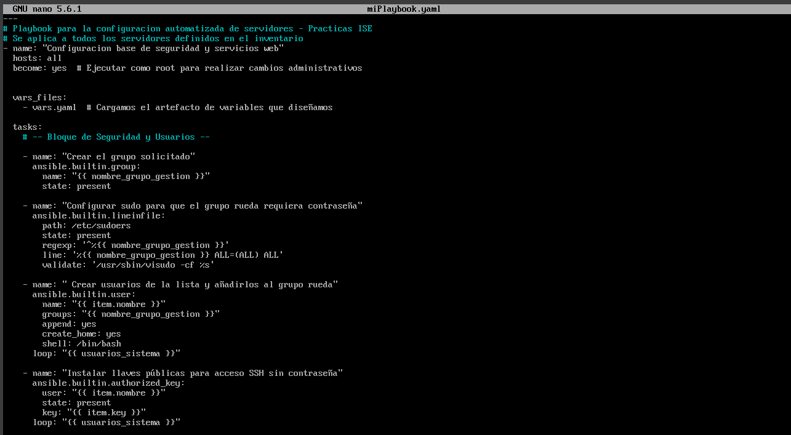 
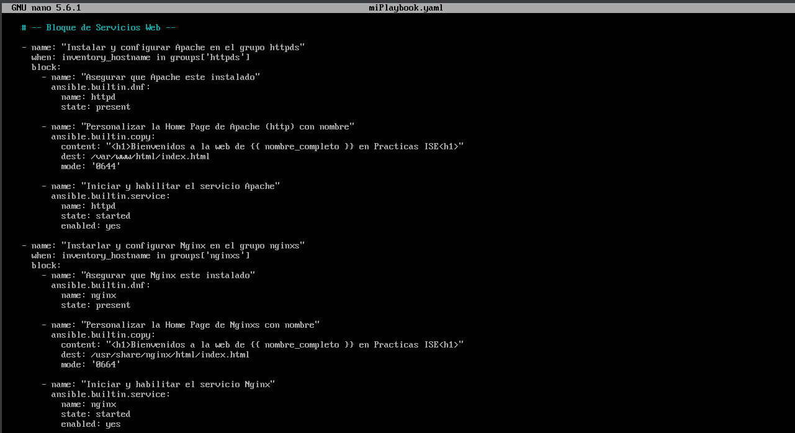 
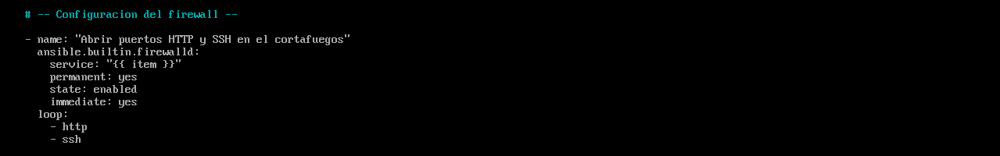

1.5. Ejecución del Proceso

Creamos un script de bash `ejecutarPlaybook.sh` que automatiza la llamada a Ansible con los parámetros correctos.

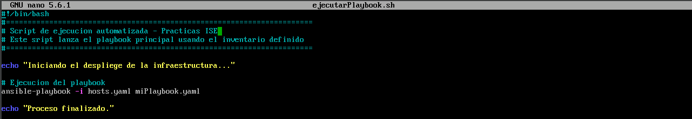

Resultado de la ejecución del script: 

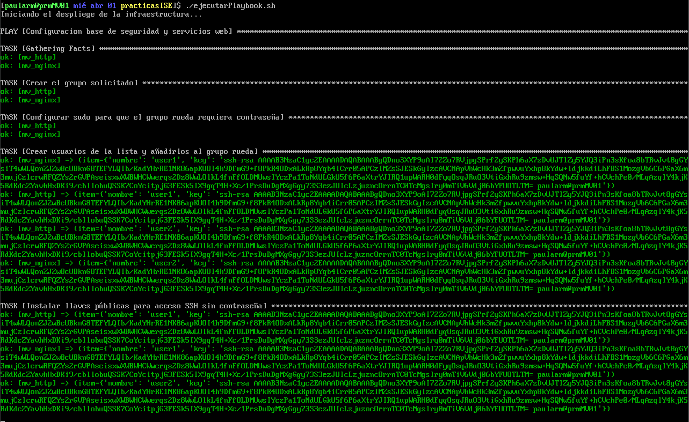
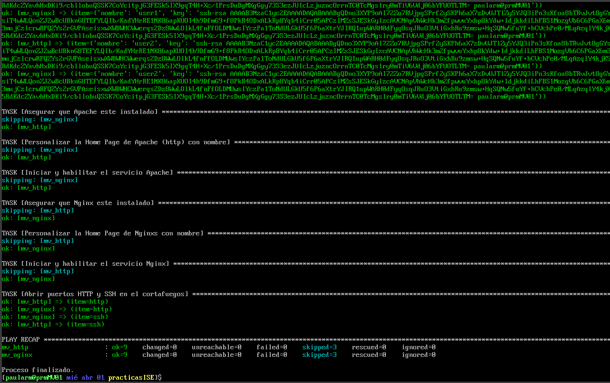

La ejecución finaliza con un resumen de cambios exitoso. Se puede observar que todos los nodos han procesado las tareas sin errores (failed=0).

1.6. Pruebas de Validación

> *Nodo Control: Se valida el acceso mediante par de llaves asimétricas y la pertenencia al grupo de gestión con privilegios administrativos restringidos.* 

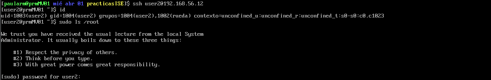
> *Nodo Control: Se valida el acceso mediante par de llaves asimétricas y la pertenencia al grupo de gestión con privilegios administrativos restringidos.* 

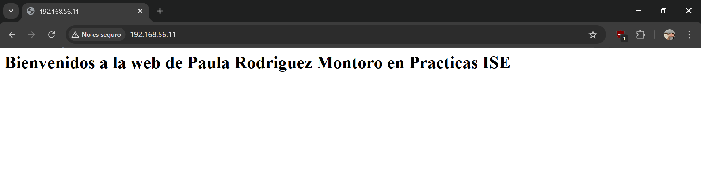
> *Servidor 1 (Apache): Captura de http://192.168.56.11.*

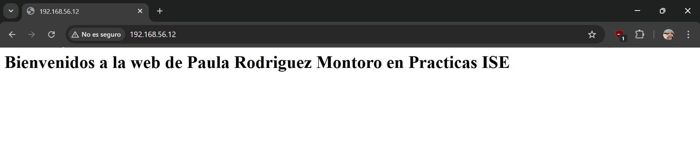
> *Servidor 2 (Nginx): Captura de http://192.168.56.12.*

Podemos observar la personalización del `index.html`con el nombre, lo que confirma que el módulo `copy/template` y el manejo de variables han funcionado correctamente.

1.7. Estructura del Proyecto

En la captura se observa el uso del comando ls -R para listar el contenido del proyecto.

* `hosts.yaml`: Inventario de servidores.
* `vars.yaml`: Definición de variables (nombres de usuarios, grupos y rutas de llaves).
* `miPlaybook.yaml`: Lógica de automatización.
* `ejecutarPlaybook.sh`: Script de lanzamiento.
* `files/`: Carpeta contenedora de las llaves públicas.

---