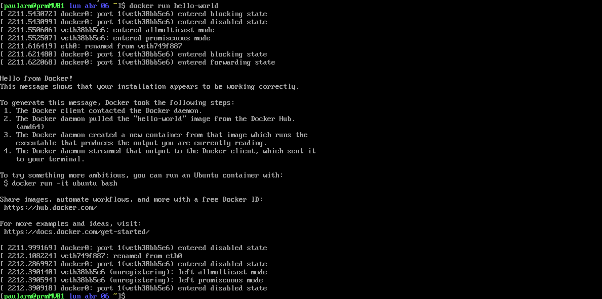

# Memoria de Prácticas: Ingeniería de Servidores
**Autor:** Paula Rodriguez Montoro
**Curso:** 2025/2026
**Repositorio:** [Enlace a mi GitHub](https://github.com/Paularodm/Ingenieria-Servidores-Practicas)

---

## BLOQUE 2: Simulación de Carga de Trabajo y Monitorización

### Práctica 1: Instalación de Docker en el SO
El objetivo de esta prática es la instalación de Docker y la ejecución del contenedor “Hello World” disponible en: https://hub.docker.com/_/hello-world.

#### Pasos realizados:
1. Configurar el repositorio. 

* `sudo dnf install -y yum-utils`  
* `sudo yum-config-manager --add-repo https://download.docker.com/linux/centos/docker-ce.repo` 

2. Instalar el motor de Docker.
   
* `sudo dnf install docker-ce docker-ce-cli containerd.io docker-buildx-plugin docker-compose-plugin`

3. Iniciar y habilitar el servicio.
   
* `sudo systemctl start docker`  
* `sudo systemctl enable docker`   
* `systemctl status docker`  

4. Permitir que el usuario gestione contenedores.

* Creamos el grupo docker: `sudo groupadd docker` 
* Añadimos el usuario al grupo: `sudo usermod -aG docker paularm`
* Aplicamos los cambios: `newgrp docker` 

#### Capturas de pantalla:

---

