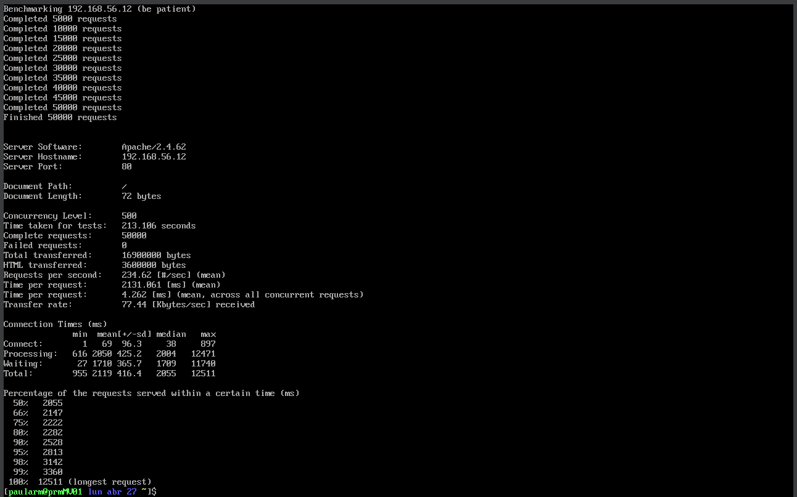
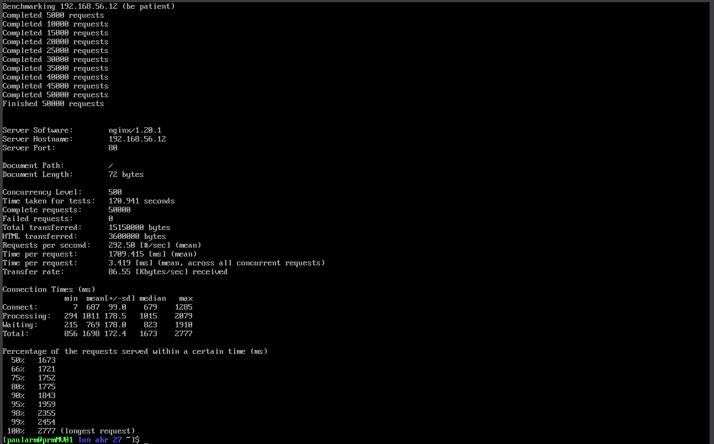

# Memoria de Prácticas: Ingeniería de Servidores
**Autor:** Paula Rodriguez Montoro
**Curso:** 2025/2026
**Repositorio:** [Enlace a mi GitHub](https://github.com/Paularodm/Ingenieria-Servidores-Practicas)

---

## BLOQUE 2: Simulación de Carga de Trabajo y Monitorización

### Práctica 2: Benchmarks

#### 2.1.- Apache Benchmark 

Para evaluar el rendimiento de los servidores web configurados en el Bloque 1 (Apache y Nginx), hemos utilizado la herramienta Apache Benchmark (ab). La prueba la he lanzado desde una máquina cliente hacia la IP del servidor 192.168.56.12.

Parámetros de la prueba:

* Número total de peticiones (-n): 50,000.

* Nivel de concurrencia (-c): 500 (peticiones simultáneas).

* Documento solicitado: / (Longitud: 72 bytes).

1. Lanzamiento: 
   

2. Resultados: 

Httpd:

Nginx:

3. Interpretación Detallada de los Resultados:
   
Rendimiento y Throughput (RPS): 

Nginx ha demostrado una mayor capacidad de despacho, alcanzando 292.50 peticiones por segundo frente a las 234.62 de Apache. Esto confirma que Nginx es más eficiente manejando un alto volumen de conexiones concurrentes en archivos estáticos.

Tiempos de Conexión y Procesamiento:
  
Waiting (Time to First Byte): En Apache, el tiempo medio de espera fue de 1710 ms, mientras que en Nginx fue de 769 ms. Esto indica que Nginx empieza a responder mucho antes bajo estrés.  

Total (Percentiles): El 99% de las peticiones en Nginx se sirvieron en menos de 2454 ms, mientras que en Apache este valor sube a 3360 ms.

Anomalía en el peor caso (Max Time): 

Es notable que la petición más lenta en Apache tardó 12.5 segundos, mientras que en Nginx el máximo fue de solo 2.7 segundos. Esto sugiere que Apache sufrió algún tipo de bloqueo de hilos o saturación de su cola de trabajo (Worker MPM) ante la concurrencia de 500, mientras que el modelo orientado a eventos de Nginx gestionó mejor las colas.

4. Razonamiento de las Diferencias 
La diferencia de rendimiento a favor de Nginx se debe a sus arquitecturas internas:

Arquitectura: Apache (en su configuración estándar) suele usar un modelo basado en procesos o hilos (MPM) que consume más RAM y CPU por cada conexión abierta. Al enfrentarse a 500 conexiones simultáneas, la sobrecarga de gestión de hilos penaliza el tiempo de respuesta.

Modelo de Eventos: Nginx utiliza un modelo no bloqueante y orientado a eventos. Un solo proceso de Nginx puede manejar miles de conexiones simultáneas con un consumo de recursos mínimo, lo que explica por qué termina el test 42 segundos antes que Apache y con una latencia mucho más baja en los percentiles altos.

---