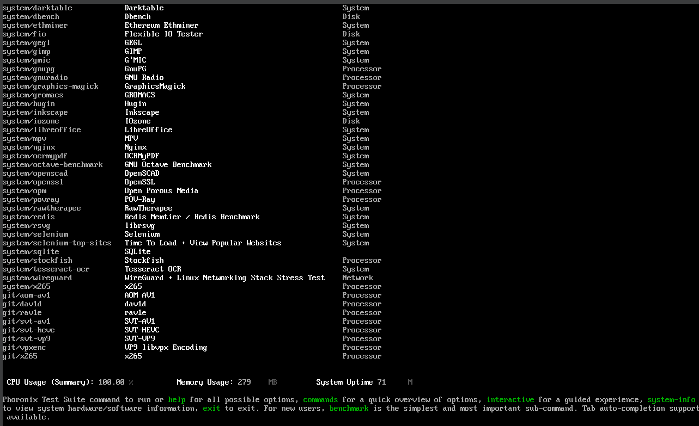
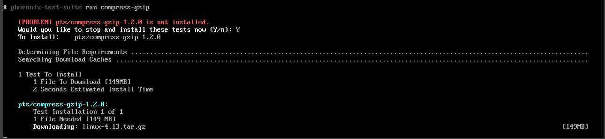
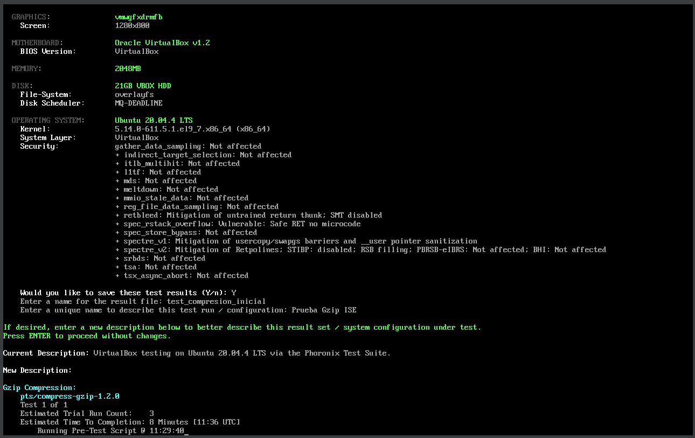
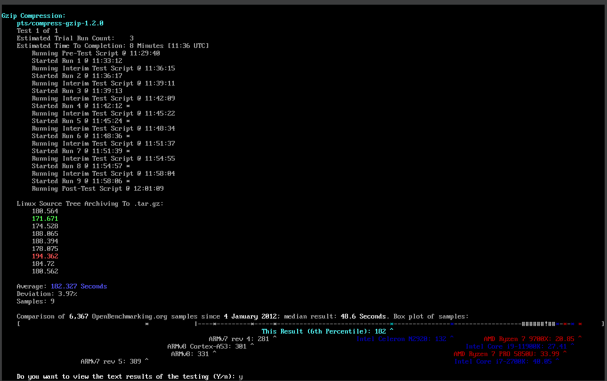
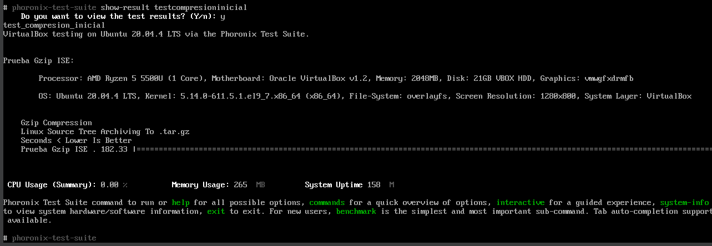

# Memoria de Prácticas: Ingeniería de Servidores
**Autor:** Paula Rodriguez Montoro
**Curso:** 2025/2026
**Repositorio:** [Enlace a mi GitHub](https://github.com/Paularodm/Ingenieria-Servidores-Practicas)

---

## BLOQUE 2: Simulación de Carga de Trabajo y Monitorización

### Práctica 2: Benchmarks

#### 2.1.- OpenBenchmarking
El objetivo es utilizar Phoronix Test Suite para descargar, instalar y ejecutar un benchmark. Debememos además almacenar y recuperar los resultados de  multiples ejecuciones del benchmark y añadir una explicacion del objetivo del benchmark y de los resultados obtenidos.

#### Pasos realizados:
1. Lanzar el entorno de Phoronix (ejecución de la plataforma).

Utilizamos la imagen oficial de Docker porque es la opción recomendada en las prácticas por su facilidad de despliegue y aislamiento.
Al ejecutar el contenedor con el flag -it, accedemos a una interfaz interactiva. 
 

2. Selección del Benchmark.
   
Para la realización de esta práctica he seleccionado el benchmark compress-gzip El objetivo principal de este benchmark es medir el rendimiento del procesador (CPU) y del subsistema de memoria al realizar tareas de compresión de datos utilizando la herramienta estándar Gzip.

Listamos los test:
   

   3. Descarga, Instalación y Ejecución
   
Para la realización de este ejercicio, se ha seleccionado el benchmark compress-gzip. Este test ha sido ejecutado mediante un contenedor Docker utilizando la imagen oficial phoronix/pts

* Instalación: Al ejecutar el comando phoronix-test-suite run compress-gzip, el software detectó que el test no estaba presente y gestionó automáticamente la descarga y compilación del código fuente necesario (linux-4.13.tar.gz).
  

* Ejecución: Aunque la estimación inicial era de 3 ejecuciones, el sistema realizó un total de 9 "Runs". Esto se debe a que PTS detectó una variabilidad significativa entre los primeros resultados y extendió las pruebas para garantizar la estabilidad estadística. La ejecución finalizó tras alcanzar una desviación típica del 3.97%.

   4. Almacenamiento y Recuperación de Resultados

* Almacenamiento: Tras completar las iteraciones, se procedió a guardar los resultados localmente en el contenedor. Se asignó el nombre de archivo testcompresioninicial y se definió el título de la configuración como Prueba Gzip ISE.

* Recuperación: Se verificó la capacidad de recuperación de los datos mediante el comando phoronix-test-suite show-result test_compresion_inicial. Este comando permite visualizar la tabla completa de resultados y los metadatos del hardware en cualquier momento sin necesidad de repetir las pruebas.

  5. Objetivo del Benchmark e Interpretación de Resultados
   
El benchmark elegido tiene como propósito evaluar la capacidad de procesamiento de la CPU y la velocidad de acceso a la memoria caché del servidor.

Análisis de los datos: 
  
- Métrica Principal: Se obtuvo un tiempo promedio de 182.327 segundos. Al ser un test de tiempo, un valor menor indica mejores prestaciones.
- Análisis del Entorno: PTS identificó correctamente que el sistema se ejecuta sobre una capa VirtualBox con un procesador AMD Ryzen 5 5500U limitado a un único núcleo.
- Comparativa Global: El resultado se sitúa en el percentil 6 de la base de datos de OpenBenchmarking.org. La mediana global para este test es de 48.6 segundos.

La marcada diferencia entre nuestro resultado (182s) y la mediana global (48s) pone de manifiesto la sobrecarga (overhead) que introduce la virtualización completa de VirtualBox. Este ejercicio confirma que, para tareas de cómputo intensivo, la asignación de un solo núcleo virtualizado penaliza severamente el rendimiento frente a ejecuciones nativas o arquitecturas de microservicios más eficientes.

---