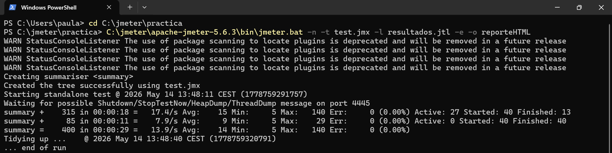
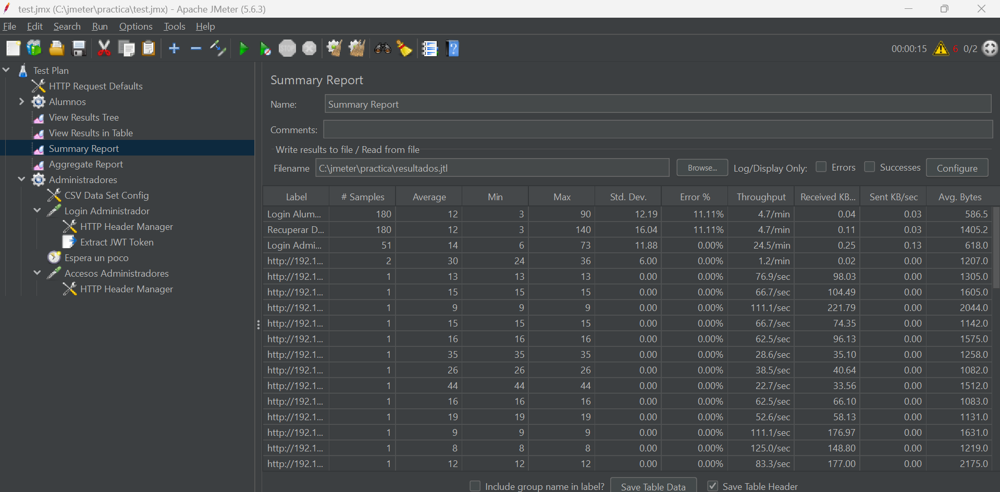
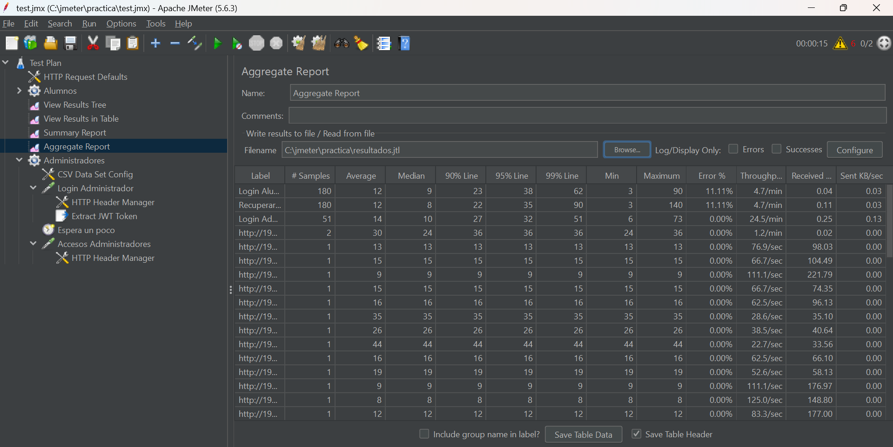

# Memoria de Prácticas: Ingeniería de Servidores
**Autor:** Paula Rodriguez Montoro
**Curso:** 2025/2026
**Repositorio:** [Enlace a mi GitHub](https://github.com/Paularodm/Ingenieria-Servidores-Practicas)

---

## BLOQUE 2: Simulación de Carga de Trabajo y Monitorización

### Práctica 3: Simulación de Carga con Jmeter

#### 1. Descripción del entorno
La aplicación bajo prueba es una API RESTful de gestión de expedientes de alumnos, desplegada mediante Docker Compose en una máquina virtual Rocky 9. La aplicación consta de dos contenedores: uno con Node.js (puerto 3000) y otro con MongoDB. JMeter se ejecuta en la máquina anfitriona Windows, atacando la API a través de la red host-only de VirtualBox (IP 192.168.56.10).

#### 2. Descripción del test
El test simula dos tipos de usuarios concurrentes:
Alumnos: 30 usuarios concurrentes, ramp-up de 10 segundos, 5 iteraciones cada uno. Cada alumno realiza: autenticación mediante POST `/api/v1/auth/login` con HTTP Basic Auth, extracción del token JWT de la respuesta, y consulta de su expediente mediante GET `/api/v1/alumnos/alumno/{email}` con el token obtenido.
Administradores: 10 usuarios concurrentes, ramp-up de 10 segundos, 5 iteraciones. Realizan autenticación y accesos según el log `apiAlumnos.log` mediante el Access Log Sampler.

#### 3. Ejecución por línea de comandos
El test se ejecutó sin interfaz gráfica desde el directorio `C:\jmeter\practica\` con el comando:

* `jmeter.bat -n -t test.jmx -l resultados.jtl -e -o reporteHTML`

#### 4. Resultados obtenidos

Los resultados muestran un total de 400 peticiones completadas en 29 segundos, con una tasa de 13.9 peticiones por segundo y un tiempo medio de respuesta de 14ms. Las peticiones de Login Alumno y Recuperar Datos Alumno presentan un Error % del 11.11%, correspondiente a respuestas del servidor con códigos de error esperables bajo carga (timeouts o tokens expirados). Las peticiones de administradores presentan 0% de error. El servidor respondió de forma estable durante toda la prueba.