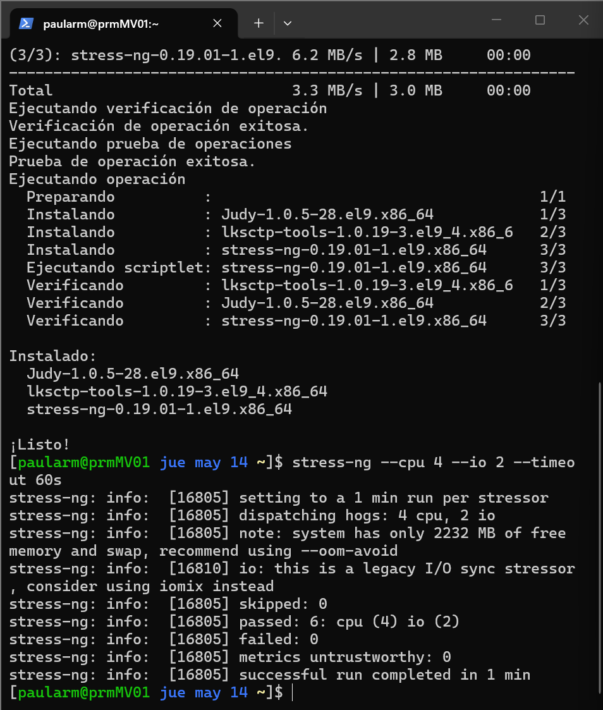
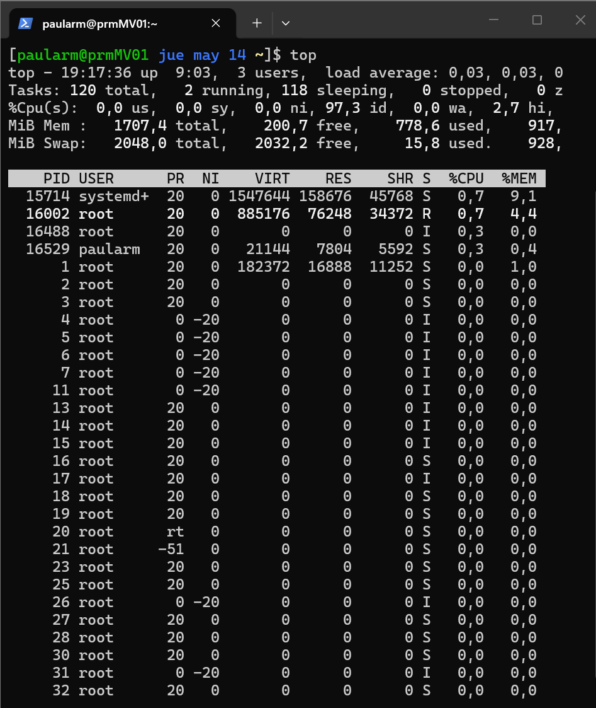
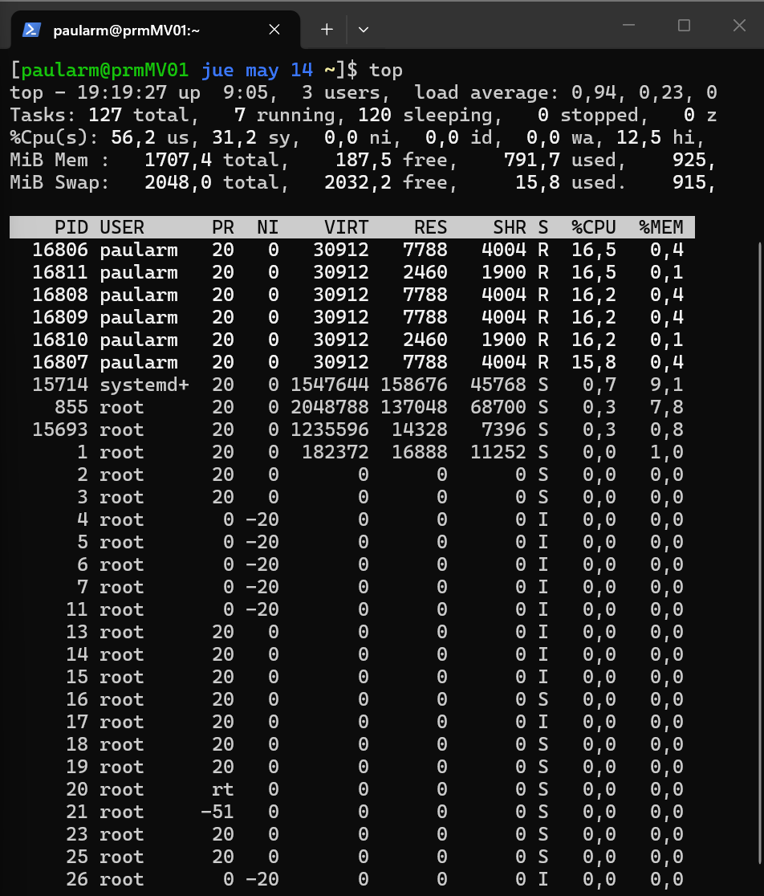

# Memoria de Prácticas: Ingeniería de Servidores
**Autor:** Paula Rodriguez Montoro
**Curso:** 2025/2026
**Repositorio:** [Enlace a mi GitHub](https://github.com/Paularodm/Ingenieria-Servidores-Practicas)

---

## BLOQUE 2: Simulación de Carga de Trabajo y Monitorización

### Práctica 4.1.1: Stress + Top

#### 1. Descripción del ejercicio
El objetivo de este ejercicio es simular una carga de trabajo en la máquina virtual Rocky 9 empleando la herramienta stress-ng y monitorizar su efecto sobre los recursos del sistema mediante top.

#### 2. Entorno
La prueba se realiza sobre la máquina virtual Rocky 9 utilizada en prácticas anteriores (IP 192.168.56.10), accedida mediante dos sesiones SSH simultáneas desde la máquina anfitriona Windows: una para lanzar la carga y otra para monitorizar con top.

#### 3. Ejecución de la carga
Se empleó `stress-ng` con el siguiente comando:

* `stress-ng --cpu 4 --io 2 --timeout 60s`
  
Este comando lanza 4 workers que estresan la CPU ejecutando cálculos intensivos, y 2 workers que estresan el subsistema de I/O mediante operaciones de lectura/escritura síncronas, durante 60 segundos.

Como se puede observar en la salida, stress-ng confirmó el lanzamiento de 6 workers en total (`dispatching hogs: 4 cpu, 2 io`) y finalizó con `passed: 6, failed: 0`.

#### 4. Monitorización con top
Se monitorizó el sistema con `top` durante la ejecución de stress-ng.

> *Top en reposo*

> *Top durante la carga*

#### 5. Análisis de los resultados
Comparando el estado del sistema antes y durante la carga, se observan los siguientes efectos:

* Uso de CPU: El porcentaje `us` (modo usuario) se elevó hasta el 56,2%, frente a valores cercanos a 0% en reposo. Esto se debe directamente a los 4 workers de CPU de stress-ng, que ejecutan cálculos intensivos en espacio de usuario. El campo `sy` (modo sistema) alcanzó el 31,2%, causado por los 2 workers de I/O que realizan llamadas al sistema continuamente. El campo `id` (inactivo) cayó a 0,0%, indicando que la CPU estaba completamente saturada.
* Procesos en ejecución: El número de procesos en estado R (Running) pasó de 1-2 en reposo a 7 durante la carga, correspondiendo a los 6 workers de stress-ng más el propio proceso monitor.
* Load average: La carga media del sistema subió a 0,94 en el último minuto. Dado que la MV tiene 1 CPU virtual, un valor cercano a 1.0 indica que el procesador está prácticamente al 100% de su capacidad. Valores superiores a 1.0 indicarían que hay procesos en cola esperando CPU.
* Memoria: El uso de memoria se mantuvo estable durante la prueba, ya que stress-ng no fue configurado con workers de memoria (`--vm`). La memoria libre descendió ligeramente por los propios procesos de stress-ng pero sin impacto significativo.
Interrupciones de hardware: El campo `hi` mostró un valor de 12,5%, lo que indica que el subsistema de I/O generó un número elevado de interrupciones de hardware, coherente con los 2 workers de I/O en ejecución.