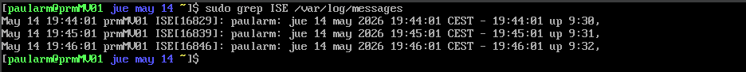

# Memoria de Prácticas: Ingeniería de Servidores
**Autor:** Paula Rodriguez Montoro
**Curso:** 2025/2026
**Repositorio:** [Enlace a mi GitHub](https://github.com/Paularodm/Ingenieria-Servidores-Practicas)

---

## BLOQUE 2: Simulación de Carga de Trabajo y Monitorización

### Práctica 4.2.1: Tarea periódica con cron

#### 1. Descripción del ejercicio
El objetivo es programar una tarea periódica en el espacio de usuario mediante cron que genere un mensaje de log con la etiqueta "ISE" y que contenga las iniciales del alumno, la fecha y hora actual, y la carga actual del sistema.

#### 2. Programación de la tarea en cron
Se editó el crontab del usuario con el comando:
* `crontab -e`
  
Y se añadió la siguiente línea:
`* * * * * logger -t ISE -p user.info "paularm: $(date) - $(uptime | awk '{print $1, $2, $3}')"`

La expresión `* * * * *` indica que la tarea se ejecuta cada minuto, todos los días. El comando `logger` envía un mensaje al sistema de logs con los siguientes parámetros:

* `-t ISE`: etiqueta del mensaje
* `-p user.info`: facilidad `user` y nivel de prioridad `info`
* El texto del mensaje contiene las iniciales `paularm`, la fecha y hora obtenida con `$(date)`, y la carga del sistema obtenida con `$(uptime)`

#### 3. Resultado en los logs del sistema
Tras esperar unos minutos, se comprobó el resultado en los logs del sistema con:
* `sudo grep ISE /var/log/messages`
  

Como se puede observar, el sistema registró automáticamente una entrada por minuto con la etiqueta ISE, conteniendo las iniciales del usuario, la fecha y hora exacta de ejecución, y la carga del sistema en ese momento. Esto confirma que cron ejecutó la tarea periódica correctamente y que `logger` envió los mensajes al sistema de logs del sistema operativo.