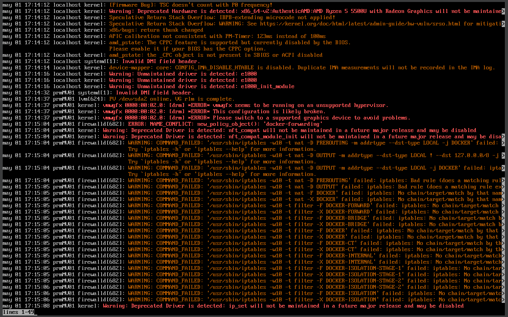
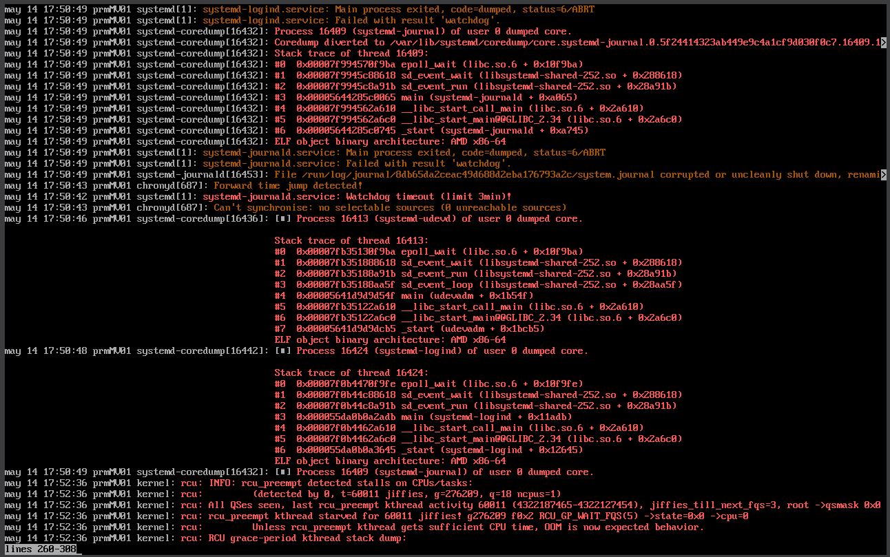
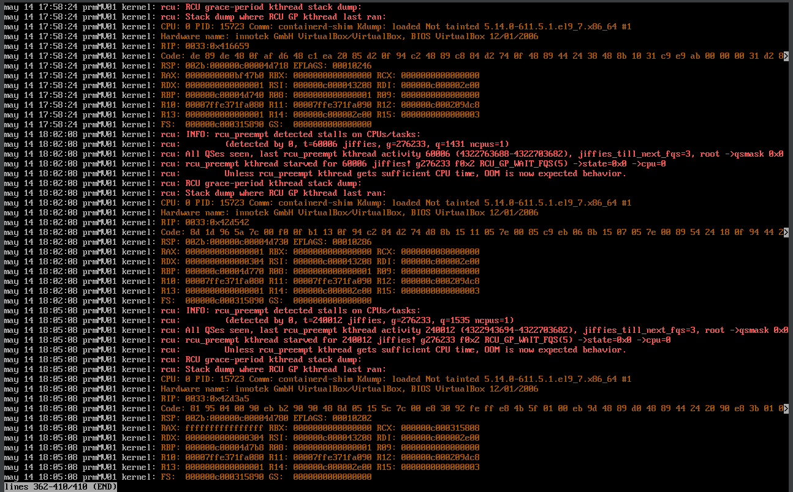

# Memoria de Prácticas: Ingeniería de Servidores
**Autor:** Paula Rodriguez Montoro
**Curso:** 2025/2026
**Repositorio:** [Enlace a mi GitHub](https://github.com/Paularodm/Ingenieria-Servidores-Practicas)

---

## BLOQUE 2: Simulación de Carga de Trabajo y Monitorización

### Práctica 4.3.1: Logs de arranque del sistema

#### 1. Descripción del ejercicio
El objetivo es consultar los logs del último arranque de la máquina virtual Rocky 9 empleando `journalctl`, filtrando únicamente los mensajes de nivel warning o más graves.

#### 2. Comando ejecutado
* `journalctl -b 0 -p warning`
  
Donde:
* `-b 0`: muestra los logs del arranque actual
* `-p` warning: filtra mensajes de nivel warning y superiores (warning, error, critical, alert, emergency)

#### 3. Resultados obtenidos

 
 

Los mensajes obtenidos pueden clasificarse en varios grupos:

* Warnings de hardware: El kernel detectó hardware deprecado, concretamente el procesador AMD Ryzen 5 5500U, que no tendrá soporte en futuras versiones del kernel. También se detectaron problemas con el driver gráfico `vmwgfx` al ejecutarse en un hipervisor no soportado (VirtualBox).

* Warnings de firewall y Docker: El servicio `firewalld` generó múltiples warnings relacionados con reglas de iptables de Docker que no pudieron aplicarse correctamente durante el arranque, debido a que las cadenas de Docker aún no existían en ese momento. Son warnings esperables en un sistema con Docker instalado.

* Errores de systemd-journald: Se detectó un core dump del propio servicio `systemd-journald` con resultado `watchdog`, indicando que el servicio tardó demasiado en responder. Esto puede estar relacionado con la carga generada por stress-ng en sesiones anteriores o con limitaciones de la MV.

* Warnings del kernel RCU: El kernel reportó bloqueos en el subsistema RCU (Read-Copy-Update), relacionados con el contenedor Docker en ejecución. Son mensajes habituales en entornos virtualizados con contenedores.
