# Memoria de Prácticas: Ingeniería de Servidores
**Autor:** Paula Rodriguez Montoro
**Curso:** 2025/2026
**Repositorio:** [Enlace a mi GitHub](https://github.com/Paularodm/Ingenieria-Servidores-Practicas)

---

## BLOQUE 2: Simulación de Carga de Trabajo y Monitorización

### Práctica 4.4.1: Monitorización con Grafana + Prometheus.

#### 1. Descripción de la secuencia de pasos para ejecutar el exporter de Linux
Para monitorizar el servidor Rocky 9 se instaló `node_exporter`, un agente de Prometheus que expone métricas del sistema operativo en el puerto 9100.

Los pasos seguidos fueron:

#### 1.1. Descarga e instalación del binario:

```
cd /tmp
curl -LO https://github.com/prometheus/node_exporter/releases/download/v1.7.0/node_exporter-1.7.0.linux-amd64.tar.gz
tar -xvf node_exporter-1.7.0.linux-amd64.tar.gz
sudo mv node_exporter-1.7.0.linux-amd64/node_exporter /usr/local/bin/
```

#### 1.2 Creación de usuario dedicado y ajuste de permisos:
```
sudo useradd -rs /bin/false node_exporter
sudo chown node_exporter:node_exporter /usr/local/bin/node_exporter
sudo chcon -t bin_t /usr/local/bin/node_exporter
```

#### 1.3 Creación del servicio systemd en `/etc/systemd/system/node_exporter.service`:
```
[Unit]
Description=Node Exporter
After=network.target

[Service]
User=node_exporter
Group=node_exporter
Type=simple
ExecStart=/usr/local/bin/node_exporter --collector.systemd --collector.processes

[Install]
WantedBy=multi-user.target
1.4 Apertura de puerto en firewall y configuración de SELinux:
sudo firewall-cmd --add-port=9100/tcp --permanent
sudo firewall-cmd --reload
sudo semanage port -a -t http_port_t -p tcp 9100
```

#### 1.4 Apertura de puerto en firewall y configuración de SELinux:
```
sudo firewall-cmd --add-port=9100/tcp --permanent
sudo firewall-cmd --reload
sudo semanage port -a -t http_port_t -p tcp 9100
```

#### 1.5 Arranque y habilitación del servicio:
```
sudo systemctl daemon-reload
sudo systemctl start node_exporter
sudo systemctl enable node_exporter
sudo systemctl status node_exporter
```
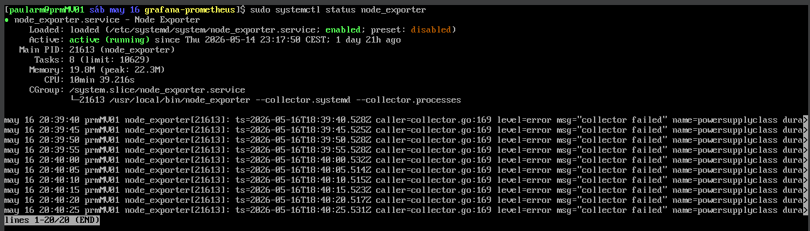

#### 1.6 Despliegue de Grafana y Prometheus con Docker Compose:
Se creó el directorio `~/grafana-prometheus` con los archivos `docker-compose.yml` y prometheus.yml. Prometheus se configuró para scrapear las métricas de node_exporter en `192.168.56.10:9100` cada 5 segundos.
```
docker compose up -d
```
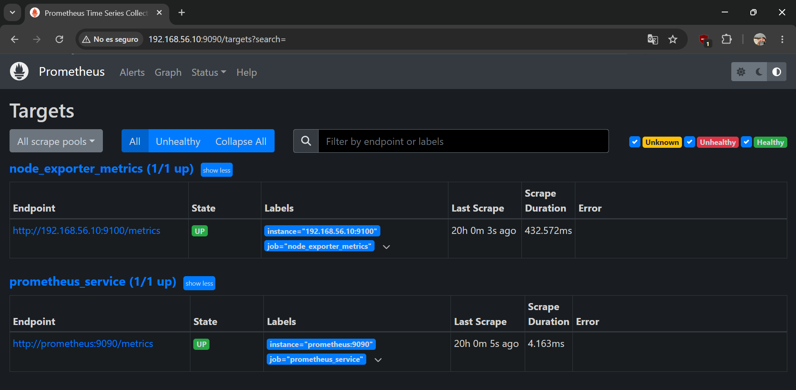

#### 1.7 Importación del dashboard en Grafana:
Se importó el dashboard con ID 1860 (Node Exporter Full) desde Grafana, renombrándolo como `paulaRodriguezMontoroLinux` y configurando Prometheus como datasource con URL `http://prometheus:9090`.

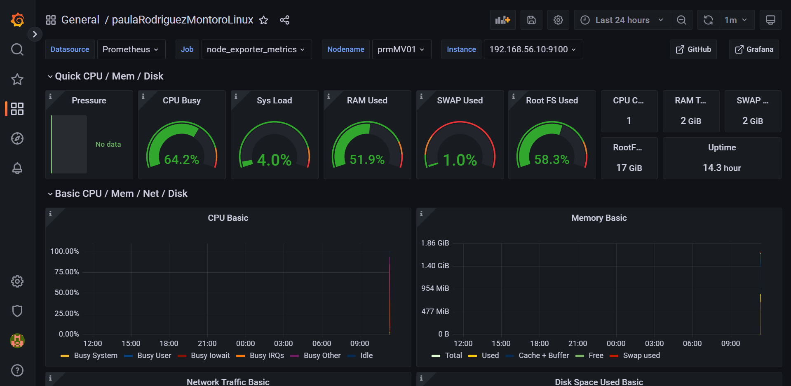

#### 2. Monitores de SSHD y HTTPD
Se añadieron dos paneles de tipo Stat al dashboard para monitorizar el estado de los servicios SSHD y Apache HTTPD, usando las métricas de node_exporter con los títulos `Estado SSHD (PRM)` y `Estado HTTPD (PRM)`.

Servicios activos (valor 1):

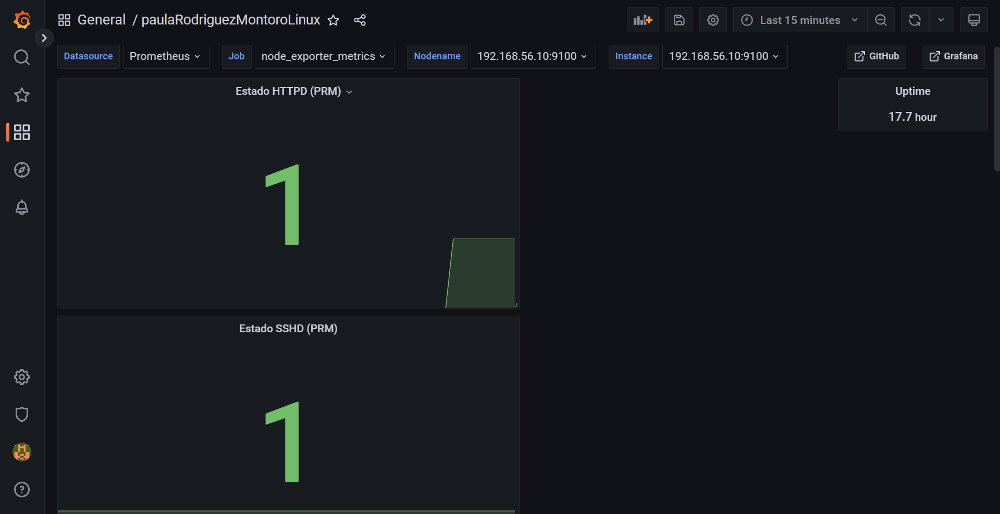

SSHD inactivo (valor 0):
Ejecutando `sudo systemctl stop sshd` el panel refleja el cambio:

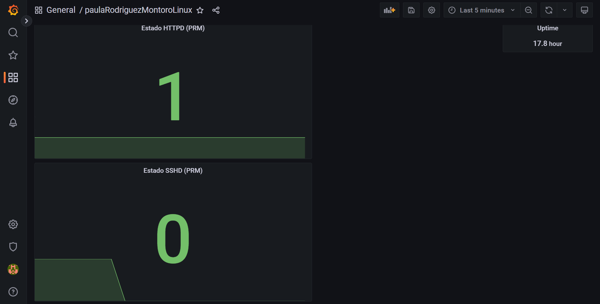

HTTPD inactivo (valor 0):
Ejecutando `sudo systemctl stop httpd` el panel refleja el cambio:

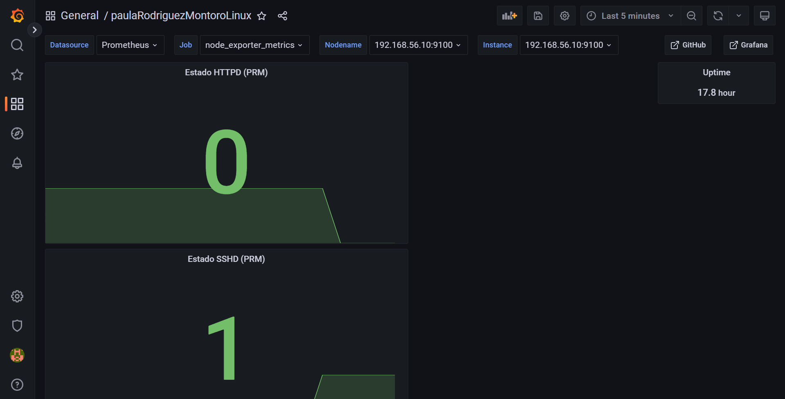

#### 3. Monitor de uso de CPU antes y después de lanzar carga
Se añadió un panel de tipo Time series con título `%CPU (PRM)` usando la métrica:
```
100 - (avg(irate(node_cpu_seconds_total{mode="idle"}[5m])) * 100)
```
Antes de lanzar la carga, el uso de CPU se mantiene en valores bajos (~15-20%).

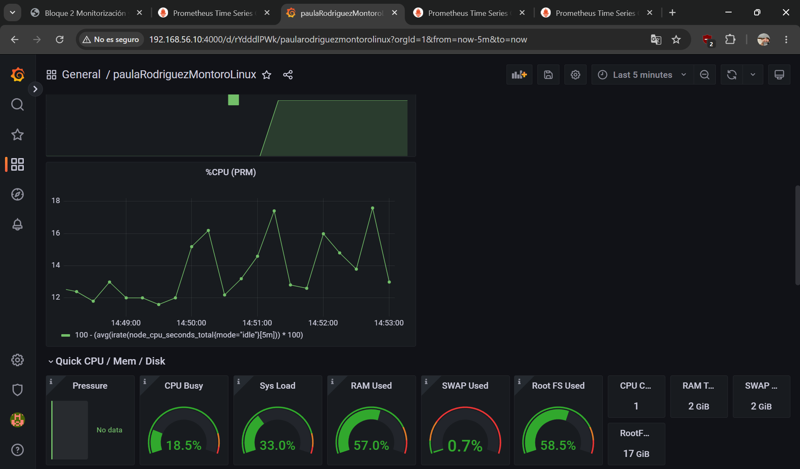

Después de lanzar la carga, el uso de CPU sube hasta el 100%.

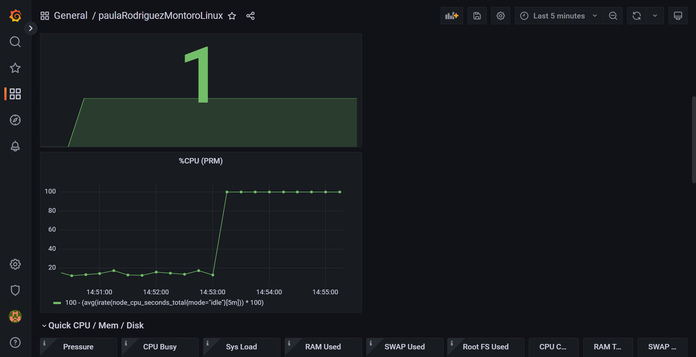


#### 4. Comando empleado para disparar la carga de CPU
Se utilizó la herramienta `stress-ng` para generar carga artificial sobre los 4 núcleos de la CPU durante 10 minutos:
```
stress-ng --cpu 4 --timeout 600s
```
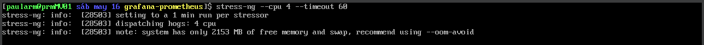

#### 5. Disparo de la alarma asociada al monitor de CPU
Se configuró una regla de alerta en Grafana (Alerting → Alert rules) con nombre `Alarma CPU (PRM)` con los siguientes parámetros:

* Condición: CPU media superior al 75%
* Evaluate every: 1 minuto
* For: 5 minutos

La alarma pasa por los estados Normal → Pending → Firing conforme el uso de CPU supera el umbral durante el tiempo configurado.

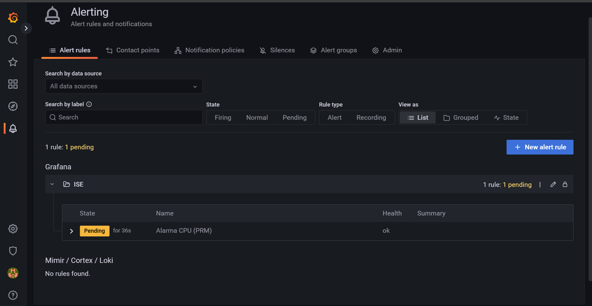

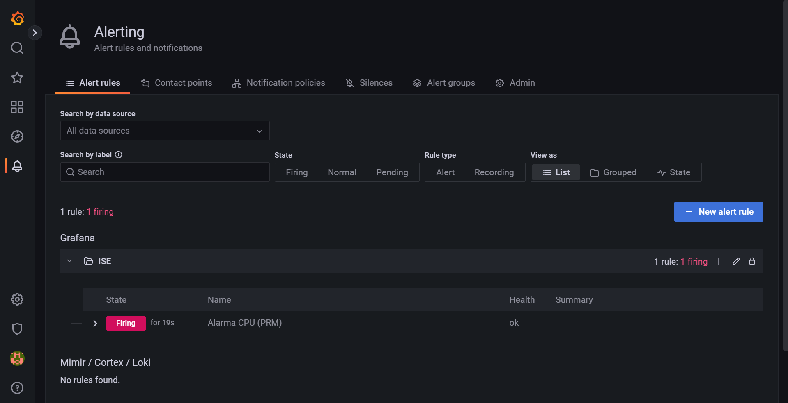


